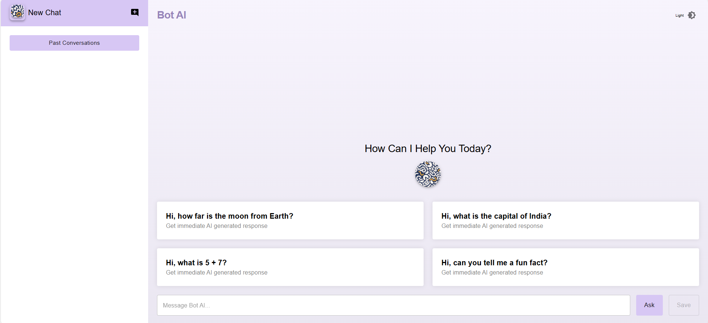

# BOT AI - Chat Application with Fake AI Model

## The App

**Crio Code-A-Thon Project:** Implementation of a React-based web application  where the user can chat with an AI model. 

## Features:
-  The user is able to give some feedback at each stage of the conversation.
- The user is able to like/dislike the AI model's answer using the thumbs up/thumbs down buttons. These buttons are hidden and float when the mouse hovers over the AI model's response.
- The user is able to have multiple such conversations.
- Once the user is done having that conversation, the chat gets saved. This chat can be revisited from a panel on the side/top bar.
- A custom JSON file is used to mock AI model response which includes the response for a particular question.

## Tech Used

`HTML`
`CSS`
`REACT JS`

- <a href="https://botai-six.vercel.app/" target="_blank">Click here for demo</a>

**Had fun building!** 🚀